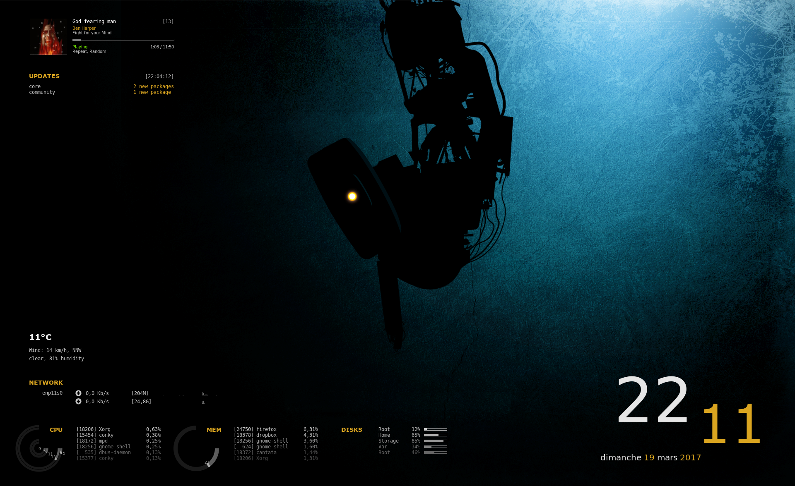

# conky-config

My personal conky configuration files for dark desktop backgrounds.

## Installation

Download the `.conky.d/` and `.covers/` directories and put them in
your HOME directory. `.conky.d/` contains all the conky configuration
files and the associated scripts, `.covers/` is used by `conkyrc_mpd`
to save the downloaded covers.

Each conkyrc file can be run independently. For example, you can run
`conkyrc_clock` using:

`conky -c ~/.conky.d/conkyrc_clock`

Note that `conkyrc_updates` is meant for Archlinux system only (it
uses the package manager `pacman`).

## Configuration

Several conkyrc files uses external scripts, written either in Python
3 or Lua. Since the Lua scripts uses the cairo library, conky needs
to be compile with both Lua and cairo support.

In addition, some scripts must be tweaked for your own system. More
specifically:

- `conkyrc_cpu` assumes the system has 4 CPU and `conky_disk` is setup
  for a system with `/root`, `/var`, `/home`, `/boot` on different
  partitions and with an additional disk mounted on `/mnt/Storage`. As
  a result, you will have to adapt these configuration file and the
  associated Lua scripts to your system specifications.
- `conkyrc_network` monitors two wired interfaces named enp11s0 and
  enp13s0. Adapt those names to match your interfaces (you can list
  them using `ifconfig`).
- In `conkyrc_weather_simple`, you need to change
  the
  [ICAO](https://en.wikipedia.org/wiki/International_Civil_Aviation_Organization_airport_code) code
  corresponding to the city you wish to monitor;

The fonts `DejaVu Sans Mono` and `Verdana` are used more or less in
all the configuration files. `conkyrc_network` also use the font
`PizzaDude Bullets` to display the upload and download arrows.

Well deserved credits are due to the original author of `paconky`,
which have been modified (more or less heavily) for use with this
conky setup.

